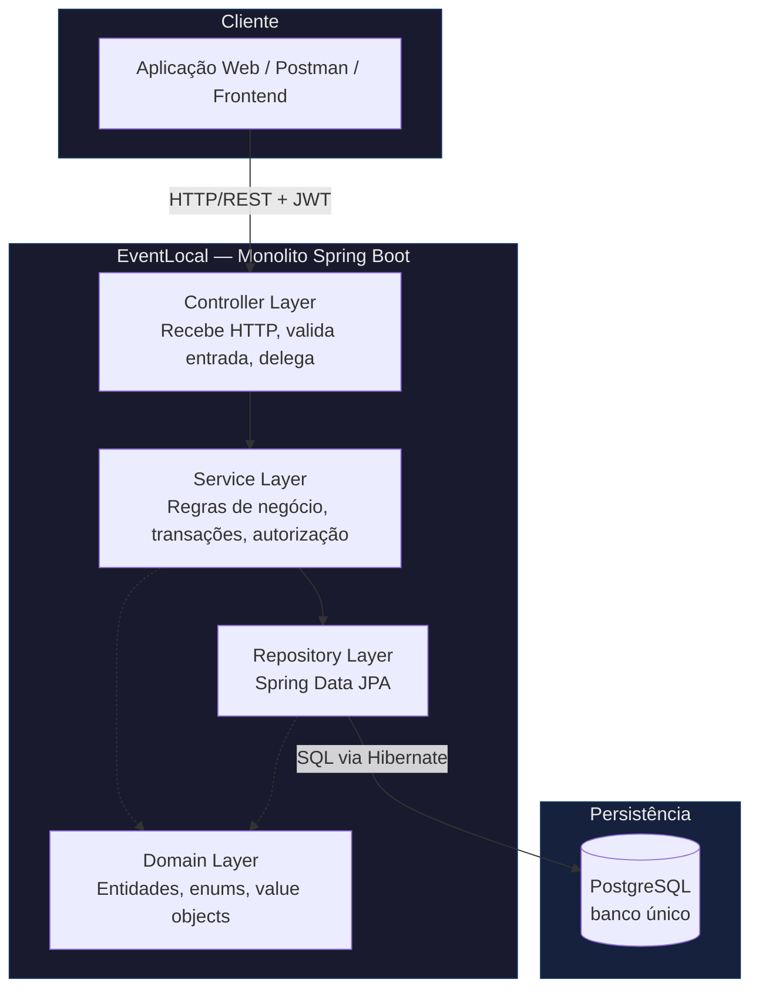
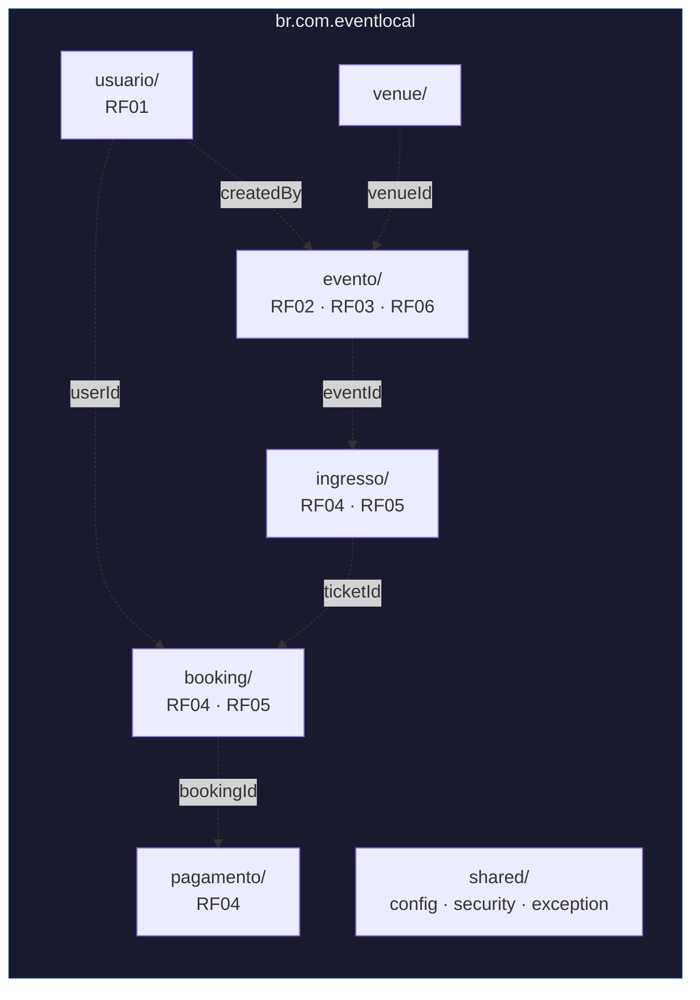
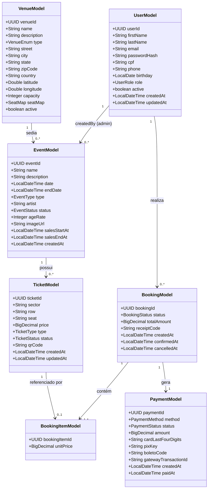
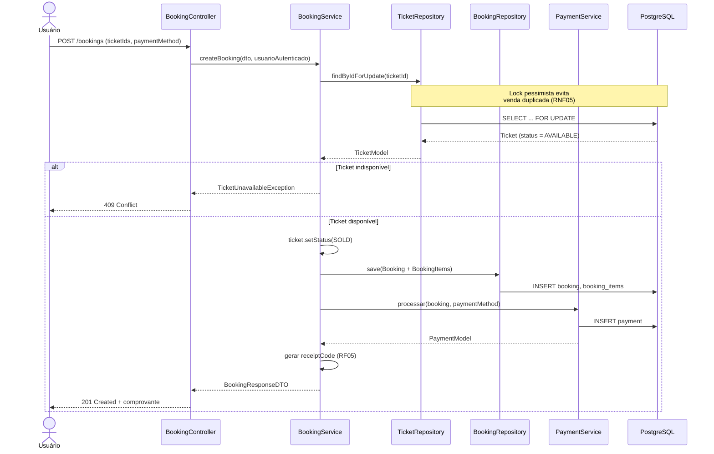
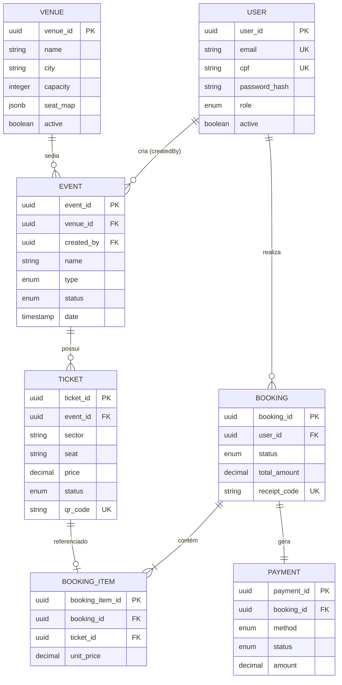

# BR Tickets I - Sistema de Venda de Ingressos (Monolito)

> Trabalho de Conclusão de Curso - Engenharia de Software
> Fase 1 de 2: Arquitetura Monolítica em Camadas
> Próxima fase: migração para microsserviços ([BRTickets II](#))

## Sobre o projeto

O **EventLocal** é a primeira fase de um estudo de migração de arquitetura monolítica
para microsserviços, utilizando como cenário um sistema de venda de ingressos inspirado
no case real do Ticketmaster.

Esta fase implementa um monolito modular em **Java 17 + Spring Boot 3.x**, organizado em
camadas (`Controller → Service → Repository`) e estruturado **por domínio de negócio**,
preparando o terreno arquitetural para a extração futura de microsserviços (Fase 2).

O objetivo acadêmico desta fase é estabelecer uma baseline funcional e mensurável e
em termos de desempenho, escalabilidade e manutenibilidade, que servirá de comparação
com a arquitetura distribuída implementada posteriormente.

---

## Stack tecnológica

| Categoria | Tecnologia |
|---|---|
| Linguagem | Java 17+ |
| Framework | Spring Boot 3.x |
| Build | Maven |
| Banco de dados | PostgreSQL (instância única) |
| ORM | Spring Data JPA / Hibernate |
| Migração de schema | Flyway |
| Segurança | Spring Security + JWT |
| Containerização | Docker + Docker Compose |
| Observabilidade | Spring Boot Actuator + Prometheus + Grafana |
| Testes de carga | k6 / JMeter |
| Análise estática | SonarQube |

---

## Requisitos do sistema

### Requisitos Funcionais (Fase 1)

| ID | Descrição |
|---|---|
| RF01 | Cadastro e autenticação de usuários |
| RF02 | Visualização de eventos disponíveis |
| RF03 | Pesquisa de eventos por nome/data/local |
| RF04 | Compra de ingressos |
| RF05 | Geração de comprovante da compra |
| RF06 | Gerenciamento de eventos pelo administrador |

### Requisitos Não Funcionais (Fase 1)

| ID | Descrição |
|---|---|
| RNF01 | Resposta em até 2s sob carga normal |
| RNF02 | Suporte a até 100 usuários simultâneos |
| RNF03 | Dados em banco relacional único |

> Os requisitos RF07–RF10 e RNF04–RNF10, relativos à arquitetura de microsserviços,
> estão documentados no repositório da Fase 2 (EventGlobal).

---

## Arquitetura

### Visão em camadas

O sistema segue o padrão de **Arquitetura em Camadas (Layered Architecture)**, organizada
internamente **por domínio de negócio** e não por tipo técnico. Essa escolha é central
para a narrativa do TCC: cada pacote de domínio é, em essência, um microsserviço em
potencial, recortado de forma cirúrgica na Fase 2.



### Organização por domínio



> Cada pasta de domínio (`usuario/`, `evento/`, `pagamento/`...) contém sua própria
> estrutura interna `controller / service / repository / model / dto`. Essa coesão é
> proposital: na Fase 2, cada uma dessas pastas é extraída para um microsserviço
> independente, com mínima refatoração estrutural.

---

## Modelo de domínio (Diagrama de Classes)



---

## Fluxo principal — Compra de ingresso (RF04 + RF05)



---

## Modelo entidade-relacionamento


---

## Decisões arquiteturais relevantes (justificativa acadêmica)

| Decisão | Alternativa descartada | Justificativa |
|---|---|---|
| Camadas organizadas por domínio | Camadas por tipo técnico (`controllers/`, `services/`) | Facilita a extração cirúrgica de microsserviços na Fase 2 |
| `SeatMap` como JSON convertido (Java ↔ JSONB) | Entidades `Sector`/`Row` normalizadas | Evita JOINs custosos para algo lido em bloco; YAGNI no contexto do monolito |
| Lock pessimista (`PESSIMISTIC_WRITE`) | Lock otimista / sem lock | Garante RNF05 (sem venda duplicada) em banco único — será substituído por lock distribuído (Redis) na Fase 2 |
| `Payment` em tabela única com campos por método | Herança `JOINED` (`CreditCardPayment`, `PixPayment`...) | Reduz complexidade de schema no monolito; herança se justifica quando o serviço for extraído |
| Autorização via `@PreAuthorize` | Validação manual de role no Service | Separa autorização (cross-cutting concern) de regra de negócio, alinhado a AOP do Spring |
| Soft delete (`active = false`) | Delete físico | Preserva histórico de eventos/vendas para auditoria e fins acadêmicos de análise |

---

## Como rodar o projeto

```bash
# Clonar o repositório
git clone <repo-url>
cd projeto-1-monolito

# Subir banco PostgreSQL via Docker
docker-compose up -d postgres

# Rodar as migrações Flyway e iniciar a aplicação
./mvnw spring-boot:run

# Acessar a documentação da API
http://localhost:8080/swagger-ui.html

# Acessar métricas (Actuator)
http://localhost:8080/actuator/health
```

---

## Observabilidade

A aplicação expõe métricas via Spring Boot Actuator, consumidas pelo Prometheus e
visualizadas em dashboards Grafana — usadas para estabelecer a baseline de desempenho
(RNF01, RNF02) que será comparada com a Fase 2.

```bash
docker-compose up -d prometheus grafana
```

| Serviço | URL padrão |
|---|---|
| Actuator | `http://localhost:8080/actuator` |
| Prometheus | `http://localhost:9090` |
| Grafana | `http://localhost:3000` |

---

## Roadmap do TCC

- [x] Modelagem de entidades e relacionamentos
- [x] Camada de domínio: `usuario`, `venue`, `evento`
- [ ] Camada de domínio: `ingresso`, `booking`, `pagamento`
- [ ] Autenticação JWT completa + `@PreAuthorize`
- [ ] Testes de carga (baseline RNF01/RNF02) com k6/JMeter
- [ ] Análise estática com SonarQube
- [ ] Migração para arquitetura de microsserviços (EventGlobal — Fase 2)

---

## Autor

Projeto desenvolvido como Trabalho de Conclusão de Curso em Engenharia de Software.
